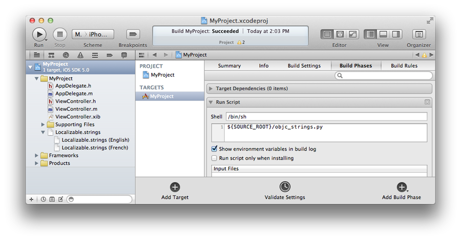
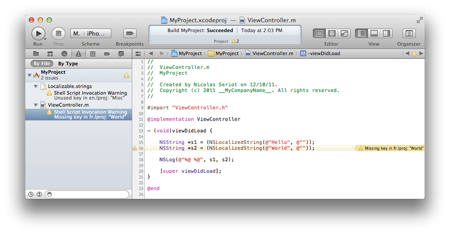

#### Goal

Helps Cocoa applications localization by detecting unused and missing keys in '.strings' files.

#### Input

Path of an Objective-C project.

#### Output

1. warnings for untranslated strings in *.m
2. warnings for unused keys in Localization.strings

#### Typical usage

    $ python objc_strings.py /path/to/obj_c/project

#### Xcode integration

1. copy `objc_strings.py` to the root of your project
2. add a "Run Script" build phase to your target
3. shell: `/bin/sh`
4. script: `${SOURCE_ROOT}/objc_strings.py`

